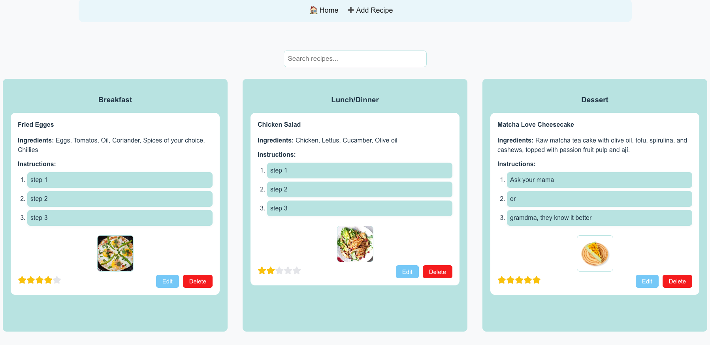

# Recipe App

A simple React app to create, edit/update, delete, search, and rate your favorite recipes.\
Recipes are organized by category (Breakfast, Lunch/Dinner, Dessert), can have images, and are saved in your browser’s local storage.


---

## Features

- Add, edit, and delete recipes (for delete you need confirmation)
- Add a photo (image is saved locally)
- Assign recipes to categories
- Search recipes by keyword (title, ingredient, instruction)
- Rate each recipe with 1–5 stars
- Data persists via localStorage

---

## Installation

1. **Clone this repository**
2. **Install dependencies**
   ```bash
   npm install
   ```
3. **Run the app**
   ```bash
   npm run dev
   ```
   The app will open at [http://localhost:5173](http://localhost:5173) (or a similar port).

---

## Required Libraries
Install the following with `npm install` ....

- [react](https://react.dev/)
- [react-dom](https://react.dev/)
- [react-router-dom](https://reactrouter.com/)
- [react-icons](https://react-icons.github.io/react-icons/)


---

## Tutorials Used

- **CRUD Operations in ReactJS:**  
  [How to do CRUD operations in ReactJS ?](https://www.geeksforgeeks.org/reactjs/how-to-do-crud-operations-in-reactjs/)


- **Image Upload & Preview:**\
  [GeeksforGeeks - How to Upload Image and Preview it using ReactJS](https://www.geeksforgeeks.org/reactjs/how-to-upload-image-and-preview-it-using-reactjs/)
- **Star Rating UI:**\
  [YouTube - Build a Star Rating System in React](https://www.youtube.com/watch?v=eDw46GYAIDQ\&ab_channel=EricMurphy)

---

## Screenshot



by Backtash 2025


